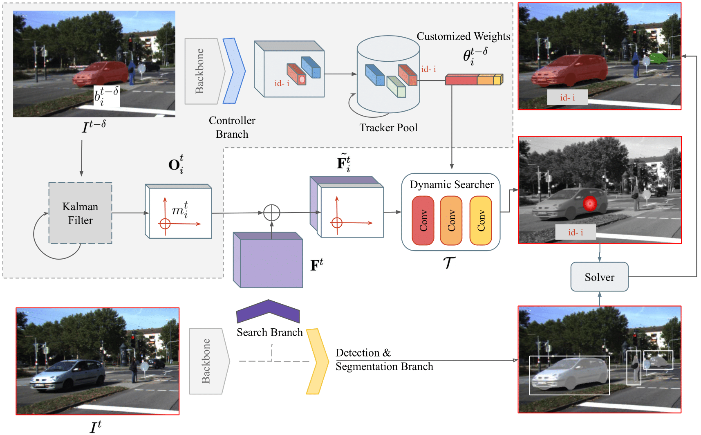

# SearchTrack
(BMVC 2022) SearchTrack: Multiple Object Tracking with Object-Customized Search and Motion-Aware Features

> [**SearchTrack: Multiple Object Tracking with Object-Customized Search and Motion-Aware Features**](https://arxiv.org/abs/2210.16572),  
> Zhong-Min Tsai*, Yu-Ju Tsai*, Chien-Yao Wang, Hong-Yuan Liao, Youn-Long Lin, Yung-Yu Chuang,  
> *BMVC 2022*  
> *[Paper Link](https://arxiv.org/abs/2210.16572)*  
*Contributed equally 

Contact: [qa276390@gmail.com](mailto:qa276390@gmail.com) or [r06922009@cmlab.csie.ntu.edu.tw](mailto:r06922009@cmlab.csie.ntu.edu.tw). Any questions or discussion are welcome! 

## Abstract

The paper presents a new method, SearchTrack, for multiple object tracking and segmentation (MOTS). To address the association problem between detected objects, SearchTrack proposes object-customized search and motion-aware features. By maintaining a Kalman filter for each object, we encode the predicted motion into the motion-aware feature, which includes both motion and appearance cues. For each object, a customized fully convolutional search engine is created by SearchTrack by learning a set of weights for dynamic convolutions specific to the object. Experiments demonstrate that our SearchTrack method outperforms competitive methods on both MOTS and MOT tasks, particularly in terms of association accuracy. Our method achieves 71.5 HOTA (car) and 57.6 HOTA (pedestrian) on the KITTI MOTS and 53.4 HOTA on MOT17. In terms of association accuracy, our method achieves state-of-the-art performance among 2D online methods on the KITTI MOTS.

## Main results

### KITTI MOTS test set 

|             |  HOTA      |  sMOTSA  |  AssA   |
|-------------|------------|----------|----------
|Car          | 71.5       |   74.9   |  67.1   |
|Pedestrian   | 57.6       |   60.6   |  53.1   |

### Pedestrian tracking on MOT17 test set

| Detection    |  HOTA    |  MOTA   |  AssA | 
|--------------|----------|---------|-------|
|Public        | 53.4     |  68.0   | 51.6  |

## Installation

Please refer to [INSTALL.md](readme/INSTALL.md) for installation instructions.

## Benchmark Evaluation and Training

After [installation](readme/INSTALL.md), follow the instructions in [DATA.md](readme/DATA.md) to setup the datasets. We provide scripts for all the experiments in the [experiments](experiments) folder. Also, models can be found in [MODEL_ZOO.md](readme/MODEL_ZOO.md).

## License

SearchTrack is developed upon [CenterNet](https://github.com/xingyizhou/CenterNet) and [CenterTrack](https://github.com/xingyizhou/CenterTrack). Both codebases are released under MIT License themselves. Some code of CenterNet are from third-parties with different licenses, please check the CenterNet repo for details. In addition, this repo uses [mots_tools](https://github.com/VisualComputingInstitute/mots_tools) and [TrackEval](https://github.com/JonathonLuiten/TrackEval) for evaluation and visualization. See [NOTICE](NOTICE) for detail. Please note the licenses of each dataset. Most of the datasets we used in this project are under non-commercial licenses.

## Citation
If you find this project useful for your research, please use the following BibTeX entry.

~~~
@inproceedings{tsai2022searchtrack,
  title={SearchTrack: Multiple Object Tracking with Object-Customized Search and Motion-Aware Features.},
  author={Tsai, Zhong-Min and Tsai, Yu-Ju and Wang, Chien-Yao and Liao, Hong-Yuan and Lin, Youn-Long and Chuang, Yung-Yu},
  booktitle={BMVC},
  year={2022}
}
~~~