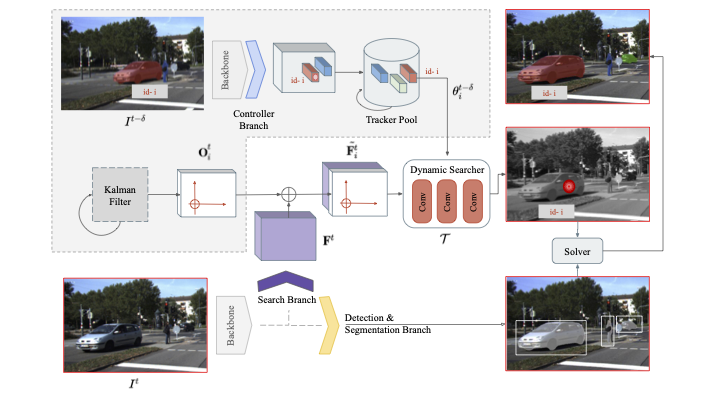

# SearchTrack
SearchTrack: Multiple Object Tracking with Object-Customized Search and Motion-Aware Features

<!-- > [**Tracking Objects as Points**](http://arxiv.org/abs/2004.01177),            
> Xingyi Zhou, Vladlen Koltun, Philipp Kr&auml;henb&uuml;hl,        
> *arXiv technical report ([arXiv 2004.01177](http://arxiv.org/abs/2004.01177))*  

    @article{zhou2020tracking,
      title={Tracking Objects as Points},
      author={Zhou, Xingyi and Koltun, Vladlen and Kr{\"a}henb{\"u}hl, Philipp},
      journal={ECCV},
      year={2020}
    } -->

Contact: [qa276390@gmail.com](mailto:qa276390@gmail.com). Any questions or discussion are welcome! 

## Abstract
This project describe in paper presents a new method, SearchTrack, for multiple object tracking and segmentation (MOTS). To better resolve the association problem between detected objects, SearchTrack proposes to use object-customized search and motion-aware features. By maintaining a Kalman filter for each object, we encode the predicted motion into the motion-aware feature, which contains both motion and appearance cues. SearchTrack forms a customized fully convolutional search engine for each object by learning a set of weights for dynamic convolutions specific for the object. Our experiments demonstrate that our SearchTrack 018 method outperforms competitive methods on both MOTS and MOT tasks, particularly in terms of association accuracy.

## Main results

### KITTI MOTS test set 

|             |  HOTA      |  sMOTSA   |
|-------------|------------|----------|
|Car          | 71.5       |   74.9   |
|Pedestrian   | 57.6       |   60.6   |

### Pedestrian tracking on MOT17 test set

| Detection    |  HOTA     | MOTA   |
|--------------|----------|--------|
|Public        | 53.4     |  68.0   |

## Installation

Please refer to [INSTALL.md](readme/INSTALL.md) for installation instructions.

## Benchmark Evaluation and Training

After [installation](readme/INSTALL.md), follow the instructions in [DATA.md](readme/DATA.md) to setup the datasets. We provide scripts for all the experiments in the [experiments](experiments) folder. Also, models can be found in [MODEL_ZOO.md](readme/MODEL_ZOO.md).

## License

SearchTrack is developed upon [CenterNet](https://github.com/xingyizhou/CenterNet) and [CenterTrack](https://github.com/xingyizhou/CenterTrack). Both codebases are released under MIT License themselves. Some code of CenterNet are from third-parties with different licenses, please check the CenterNet repo for details. In addition, this repo uses [py-motmetrics](https://github.com/cheind/py-motmetrics) and [TrackEval](https://github.com/JonathonLuiten/TrackEval) for evaluation. See [NOTICE](NOTICE) for detail. Please note the licenses of each dataset. Most of the datasets we used in this project are under non-commercial licenses.

