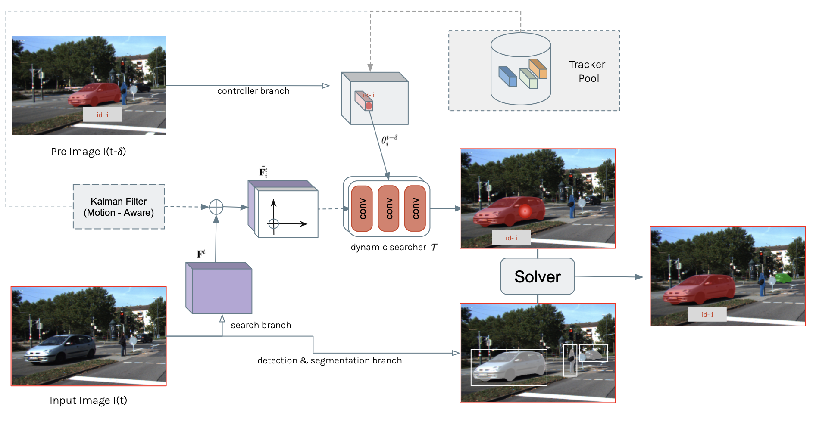

# SearchTrack
A Search-Based Tracker with Poisition-Aware Motion Model:

<!-- > [**Tracking Objects as Points**](http://arxiv.org/abs/2004.01177),            
> Xingyi Zhou, Vladlen Koltun, Philipp Kr&auml;henb&uuml;hl,        
> *arXiv technical report ([arXiv 2004.01177](http://arxiv.org/abs/2004.01177))*  

    @article{zhou2020tracking,
      title={Tracking Objects as Points},
      author={Zhou, Xingyi and Koltun, Vladlen and Kr{\"a}henb{\"u}hl, Philipp},
      journal={ECCV},
      year={2020}
    } -->

Contact: [qa276390@gmail.com](mailto:qa276390@gmail.com). Any questions or discussion are welcome! 

## Abstract
In this project we focus on dealing with multiple-object tracking and segmentation(MOTS) problem. Top-performing work such as PointTrack focus on finding better representation
for the appearance identities. In addition to object appearance, object motion is another key element that should be reckoned with while doing association. Instead of choose one
of the them, we employ dynamic instance-aware networks combined with coordinate map given by Kalman filter. With the hint of predicted motion, our dynamic searcher could localize the associated object in next frame. Our work, SearchTrack, shows a compre- hensive thought of appearance and motion. We present a joint tasks tracker that is fast, straight-forward and more accurate than the state-of-the-art online method, in both 2D MOTS and MOT. It achieves 71.2 HOTA (car) and 57.6 HOTA (pedestrian) on KITTI MOTS leaderboard and 53.1 HOTA on MOT17.

<!-- ## Features at a glance

- One-sentence method summary: Our model takes the current frame, the previous frame, and a heatmap rendered from previous tracking results as input, and predicts the current detection heatmap as well as their offsets to centers in the previous frame.

- The model can be trained on still **image datasets** if videos are not available.

- Easily extends to monocular 3d object tracking, multi-category tracking, and pose tracking.

- State-of-the-art performance on MOT17, KITTI, and nuScenes monocular tracking benchmarks. -->

## Main results

### KITTI MOTS test set 

|             |  HOTA      |  sMOTSA   |
|-------------|------------|----------|
|Car          | 71.5       |   74.9   |
|Pedestrian   | 57.6       |   60.6   |

### Pedestrian tracking on MOT17 test set

| Detection    |  HOTA     | MOTA   |
|--------------|----------|--------|
|Public        | 53.4     |  68.0   |

## Installation

Please refer to [INSTALL.md](readme/INSTALL.md) for installation instructions.

## Benchmark Evaluation and Training

After [installation](readme/INSTALL.md), follow the instructions in [DATA.md](readme/DATA.md) to setup the datasets. Then check [GETTING_STARTED.md](readme/GETTING_STARTED.md) to reproduce the results in the paper.
We provide scripts for all the experiments in the [experiments](experiments) folder.

## License

SearchTrack is developed upon [CenterNet](https://github.com/xingyizhou/CenterNet) and [CenterTrack](https://github.com/xingyizhou/CenterTrack). Both codebases are released under MIT License themselves. Some code of CenterNet are from third-parties with different licenses, please check the CenterNet repo for details. In addition, this repo uses [py-motmetrics](https://github.com/cheind/py-motmetrics) and [TrackEval](https://github.com/JonathonLuiten/TrackEval) for evaluation. See [NOTICE](NOTICE) for detail. Please note the licenses of each dataset. Most of the datasets we used in this project are under non-commercial licenses.

